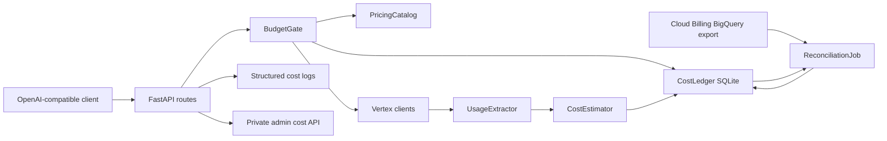
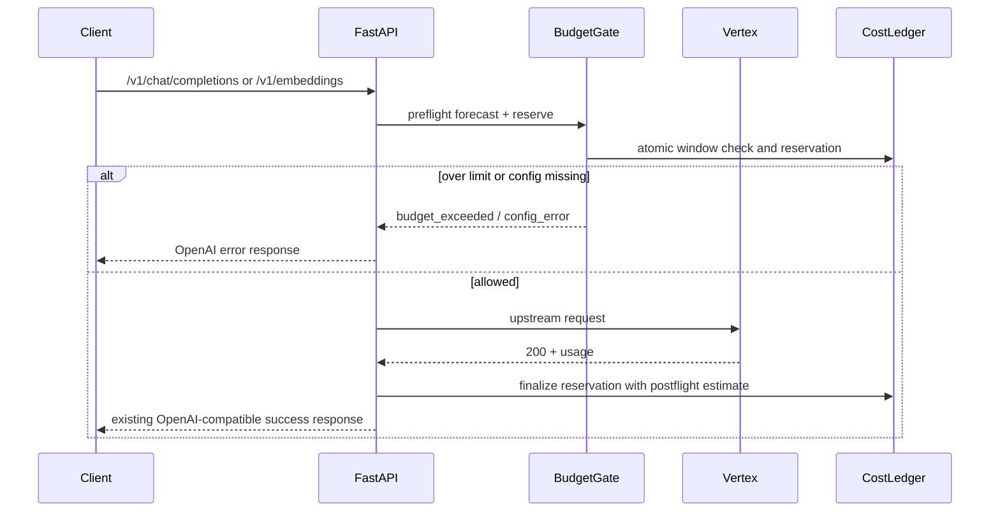

# Wrapper Cost Tracking Design Spec

## Overview

Wrapper에 request-level cost ledger, hard budget gate, private admin cost status, Cloud Billing BigQuery reconciliation을 추가한다. 목표는 실시간 invoice exactness가 아니라 비용 폭주를 즉시 차단하고, 나중에 Google Cloud Billing export와 집계 단위로 대조 가능한 운영 기록을 남기는 것이다.

## Requirements Reference

- Phase 1 source: `requirements.md`
- Preview companion: `requirements.html`
- 핵심 요구사항:
  - 예산 통제 중심
  - wrapper 전체 hard limit
  - 단기 윈도우 + 일 단위 예산
  - 성공 응답 OpenAI-compatible shape 유지
  - 차단 응답에 운영 정보 포함
  - private admin surface + structured log
  - Cloud Billing BigQuery export 기반 자동 reconciliation
  - request-level 90일, aggregate/reconciliation 13개월 보존
  - prompt/completion/vector/raw document text 저장 금지

## Single Goal Execution Contract

This design is intended to be consumed as **one long-running agentic-execution goal**, not as separate independent feature requests.

Goal:
- Implement wrapper cost tracking and hard budget enforcement end-to-end, from durable request-level estimation through budget blocking, private operational visibility, and Cloud Billing BigQuery reconciliation.

Execution mode:
- Use the `agentic-execution` loop: decompose, act, observe, adjust, repeat.
- Treat this `design.md` and the approved `requirements.md` as the source of truth.
- Implement M1-M5 in order as one continuous goal without milestone-by-milestone product approval.
- Do not ask product-level questions during execution unless reality requires changing the approved requirements or this design.
- If implementation discovers a necessary SoT change, stop and return to `grill-to-spec`.
- Keep a `milestones.md` working-state file during implementation because this is a multi-milestone, resumable task.
- All implementation work must happen in a dedicated task branch/worktree.

Definition of done:
- Every milestone in this design is done with concrete evidence.
- Existing successful `/v1/*` response shapes remain compatible.
- Budget hard limit blocks are verified for both short-window and daily budgets.
- Cost tracking persists across Docker container restart.
- Sensitive payload content is absent from ledger rows and structured logs.
- BigQuery reconciliation handles configured, pending, unavailable, and mismatch states.
- Ubuntu Docker deployment readiness is documented and smoke-tested.

Goal acceptance gates:
- `uv run pytest` passes.
- Targeted cost tests pass, including budget block, ledger reservation/finalization, streaming finalization, admin auth, redaction, retention, and reconciliation fake adapter tests.
- Docker image builds with cost tracking dependencies.
- A Docker restart persistence smoke proves the SQLite ledger survives container recreation.
- A budget block smoke returns OpenAI-compatible `budget_exceeded` with limit metadata.
- A ledger/log redaction check proves no prompt, completion, embedding vector, raw document text, provider raw response body, or provider raw error body is persisted.
- BigQuery reconciliation has local fake-adapter evidence for `matched`, `mismatch`, `pending`, `unavailable`, and permission error handling.
- Live BigQuery probing is optional and is not required for design completion unless the user explicitly approves a credential/billing-account action.

Human stop conditions during execution:
- A requirement or design change is required.
- A destructive or externally visible production mutation is required.
- A credential, billing account, or irreversible Cloud Billing export change is required.
- The implementation cannot safely enforce hard limits with the configured durable store.

Allowed implementation decisions:
- Choose internal Python module/file names for cost tracking components.
- Choose SQLite table/index names, as long as the allowlist schema and retention rules are preserved.
- Choose exact private admin route names under `/admin/cost/*`, as long as the required status/events/reconciliation capabilities exist.
- Add repo-local helper scripts or fixtures for smoke tests.
- Use local fake BigQuery adapters for automated reconciliation tests.

Must stop for product decision:
- Changing budget scope away from wrapper-wide limits.
- Adding model-level or client-level budgets.
- Exposing cost fields in normal successful OpenAI-compatible responses by default.
- Persisting any request/response payload content.
- Requiring live Cloud Billing export setup, billing account mutation, credential rotation, or external production changes.
- Replacing SQLite with a network database for the hard-limit ledger.

## Approach Proposal

선택한 접근은 **SQLite 원장 + preflight budget gate + BigQuery reconciliation**이다.

후보 A. SQLite 원장 + preflight budget gate + BigQuery reconciliation
- 장점: Docker runtime에서 단순하고 durable하며, 요청 전 reserve로 hard limit을 실제로 강제할 수 있다.
- 단점: SQLite 파일 volume과 원장 pruning이 필요하다.
- 선택 이유: 현재 wrapper는 단일 private container 성격이고, hard limit과 운영 디버깅이 핵심이라 가장 균형이 좋다.

후보 B. Structured log only + 외부 집계
- 장점: wrapper 코드가 가볍다.
- 단점: hard limit을 wrapper 내부에서 안정적으로 강제하기 어렵다.
- 제외 이유: 사용자가 예산 통제와 차단을 1차 목적으로 확정했다.

후보 C. BigQuery-first ledger
- 장점: reconciliation과 분석이 쉽다.
- 단점: request path가 외부 서비스 지연/장애에 묶이고, Billing export 자체도 지연된다.
- 제외 이유: 비용 폭주 차단은 request path에서 즉시 판정되어야 한다.

## Architecture

Components:
- `CostLedger`: durable SQLite storage for request events, reservations, aggregates, reconciliation results.
- `PricingCatalog`: runtime-loaded model/endpoint price config with explicit version/source metadata.
- `CostEstimator`: converts usage tokens/request counts to estimated cost.
- `BudgetGate`: atomically reserves forecast cost before billable upstream calls and blocks when limits are exceeded.
- `UsageExtractor`: normalizes usage from chat, embeddings, and rerank paths.
- `AdminCostAPI`: private read-only status endpoints for spend, limits, blocked state, and reconciliation status.
- `ReconciliationJob`: compares wrapper aggregates with Cloud Billing BigQuery export when configured.
- `StructuredLogger`: writes scrubbed cost events to container logs without payload content.

## Common Request Accounting Seam

All billable routes must use one shared accounting seam instead of route-local ad hoc accounting.

Required seam methods:
- `preflight(endpoint, model, forecast_context) -> Reservation | BudgetBlock`
- `finalize_success(reservation, usage, response_status=200) -> CostEvent`
- `release_nonbillable(reservation, reason) -> CostEvent`
- `finalize_estimated_only(reservation, reason) -> CostEvent`
- `mark_unhealthy(reason) -> None`

Route integration order:
- `/v1/embeddings`: validate request, forecast, preflight reserve, call Vertex, finalize with embedding token usage on 200, release reservation on upstream non-200.
- `/v1/chat/completions` non-streaming: validate request, forecast, preflight reserve, call Vertex, finalize with chat usage on 200, release reservation on upstream non-200.
- `/v1/chat/completions` streaming: validate request, forecast, preflight reserve before opening upstream stream, finalize from generator `finally` according to the streaming contract below.
- `/v1/rerank`: validate request, forecast using configured request-count/unit pricing, preflight reserve, call Vertex, finalize configured-unit estimate on 200, release reservation on upstream non-200.

The seam is responsible for:
- atomic short-window and daily-window budget checks;
- preventing repeated route-specific budget logic;
- emitting structured cost logs from allow/block/finalize/release events;
- preserving existing successful response shapes.

## Data Flow

### Non-streaming Success

### Streaming Success

- Preflight reserve happens before opening the upstream stream.
- Stream chunks keep the current OpenAI-compatible SSE shape.
- The stream generator must finalize or release the reservation in a `finally` block.
- If upstream returns 200 and final usage is available, finalize with postflight usage estimate.
- If upstream returns 200 but the client disconnects or final usage is missing, finalize as `estimated_only`; do not release the reservation because the upstream request might be billable.
- If upstream fails before a billable 200 response, release the reservation as `nonbillable_upstream_error`.
- If finalization fails, mark the cost subsystem unhealthy so subsequent preflight checks fail closed.

### Non-200 Upstream Response

- Upstream 4xx/5xx requests release reservation and are not counted as billable estimate.
- The error response remains mapped through the existing OpenAI-compatible error path.
- A non-billable failure event may be logged for audit, without cost increment.

## Component Details

### CostLedger

Inputs:
- request id
- endpoint
- model
- timestamp
- forecast cost
- postflight usage
- postflight estimated cost
- billing eligibility
- block/error/reconciliation status

Outputs:
- current short-window spend
- current daily spend
- request-level event history
- daily aggregate
- reconciliation summary

Dependencies:
- SQLite file on a mounted Docker volume.
- WAL mode for concurrent read/write behavior.

Allowlist schema:
- `event_id`
- `reservation_id`
- `internal_request_id`
- `endpoint`
- `model`
- `status`
- `billing_eligible`
- `limit_type`
- `prompt_tokens`
- `completion_tokens`
- `total_tokens`
- `embedding_tokens`
- `rerank_units`
- `forecast_cost_usd`
- `estimated_cost_usd`
- `currency`
- `pricing_source`
- `pricing_version`
- `window_started_at`
- `created_at`
- `finalized_at`
- `reconciliation_status`

Forbidden ledger/log/admin fields:
- prompt text
- completion text
- embedding vectors
- raw documents
- raw provider request body
- raw provider response body
- raw provider error body
- service account material
- bearer tokens
- un-hashed tenant/client/user identifiers

Client identity:
- Default behavior stores no client, tenant, or user identity.
- If future implementation needs client attribution, it must use a keyed hash and return to `grill-to-spec` before enabling client-level budgets.

Persistence:
- Default path is runtime-configured, for example `/data/cost-ledger.db`.
- Docker Compose must mount the directory.
- Request-level rows are pruned after 90 days.
- Daily aggregate and reconciliation rows are pruned after 13 months.

### PricingCatalog

Inputs:
- explicit runtime pricing config.
- optional Cloud Billing Pricing API or pricing export metadata later.

Outputs:
- price per model/endpoint/usage dimension.
- pricing version and source.

Rules:
- No built-in money defaults.
- Missing price for a billable request under hard limit is fail-closed.
- Each cost event stores the pricing source/version used for the estimate.

### CostEstimator

Inputs:
- normalized usage:
  - chat input tokens
  - chat output tokens
  - embedding input tokens
  - rerank request count or configured unit
- pricing entry

Outputs:
- forecast cost before upstream call.
- postflight estimated cost after usage is known.

Rules:
- Preflight must reserve a conservative forecast.
- Postflight replaces reservation with usage-based estimate when usage is available.
- If postflight estimate exceeds reservation, the overrun is recorded and future gates see the updated spend.
- Rerank remains request-count or configured-unit based until upstream usage is available.

### BudgetGate

Inputs:
- forecast cost
- short-window limit
- daily limit
- ledger current counters

Outputs:
- allow with reservation id
- block with `budget_exceeded`
- block with configuration/ledger health error

Rules:
- Budget check and reservation must be atomic.
- Either short-window or daily over-limit blocks the request.
- If ledger read/write needed for hard-limit judgment fails, fail closed.
- If reservation finalization fails after an upstream 200 response, do not mutate the already successful OpenAI-compatible response, but immediately mark the cost subsystem unhealthy.
- When the cost subsystem is unhealthy, subsequent billable request preflight checks fail closed until a restart or explicit admin recovery action restores healthy state.
- If cost tracking is disabled, the gate is bypassed.
- If cost tracking is enabled but budget amounts or pricing config are missing, billable requests are blocked with explicit config error.

### AdminCostAPI

Private endpoints:
- `GET /admin/cost/status`
- `GET /admin/cost/events`
- `GET /admin/cost/reconciliation`

Rules:
- Disabled by default unless `COST_ADMIN_ENABLED=true`.
- Requires a separate `COST_ADMIN_API_KEY`; `WRAPPER_API_KEY` is not sufficient for admin access.
- Returns 401/403 for missing or invalid admin credentials.
- Must not be enabled if `COST_ADMIN_API_KEY` is empty.
- May additionally support an IP allowlist, but API-key protection remains required.
- Not exposed as public dashboard.
- Does not return prompts, completions, vectors, or raw documents.
- Returns spend, limits, window reset times, blocked status, and reconciliation status.

### ReconciliationJob

Inputs:
- wrapper daily aggregate.
- Cloud Billing BigQuery export tables.
- pricing export or Pricing API metadata where configured.

Outputs:
- daily reconciliation result:
  - wrapper estimated spend
  - billing export cost
  - delta
  - status: `matched`, `mismatch`, `pending`, `unavailable`, `error`

Rules:
- Reconciliation is aggregate-level, not exact request-level.
- BigQuery export latency is expected; missing recent billing rows should be `pending`, not failure.
- BigQuery export not configured should be `unavailable`, not request-path failure.
- BigQuery permission denied, query failure, or schema mismatch should become reconciliation `error` without request-path impact.
- Use ADC or workload identity for BigQuery access; do not introduce or log separate BigQuery key material.
- Required IAM should be limited to BigQuery read/job execution for the configured billing export dataset.
- `billing export cost` is a reconciliation source value, not a real-time exact invoice guarantee.
- Discount, credit, tax, and currency conversion are not part of the wrapper real-time estimate.

## Error Handling

Budget block:
- HTTP status: 429
- OpenAI-compatible error type: `rate_limit_error`
- code: `budget_exceeded`
- includes:
  - `limit_type`
  - `reset_at`
  - `current_estimated_spend`
  - `configured_limit`
  - `currency`

Config error:
- Triggered when cost tracking is enabled but required pricing or budget config is missing.
- Fail closed for billable requests.
- Error code should distinguish this from ordinary upstream provider failure.

Ledger preflight failure:
- Fail closed because budget cannot be enforced safely.

Ledger finalization failure after upstream 200:
- Do not break an already successful upstream response.
- Mark the cost subsystem unhealthy with a process-local circuit breaker.
- Subsequent billable preflight checks fail closed until restart or explicit admin recovery.
- Emit structured critical log without payload content.

Structured log failure:
- Do not break an already successful upstream response.
- Do not by itself mark the budget subsystem unhealthy if ledger finalization succeeded.
- Emit a best-effort fallback log without payload content.

Reconciliation failure:
- Never blocks request serving.
- Admin status reports `pending`, `unavailable`, or `error`.

## Configuration

Required when cost tracking is enabled:
- `COST_TRACKING_ENABLED`
- `COST_LEDGER_PATH`
- `COST_PRICING_JSON` or `COST_PRICING_PATH`
- `COST_SHORT_WINDOW_SECONDS`
- `COST_SHORT_WINDOW_LIMIT_USD`
- `COST_DAILY_LIMIT_USD`

Optional:
- `COST_ADMIN_ENABLED`
- `COST_ADMIN_API_KEY`
- `COST_ADMIN_IP_ALLOWLIST`
- `COST_RECONCILIATION_ENABLED`
- `COST_BILLING_BIGQUERY_PROJECT`
- `COST_BILLING_BIGQUERY_DATASET`
- `COST_BILLING_BIGQUERY_TABLE`
- `COST_PRICING_SOURCE`
- `COST_RETENTION_REQUEST_DAYS`
- `COST_RETENTION_AGGREGATE_MONTHS`

No budget money default should be compiled into code.

Dependency and deployment notes:
- Reconciliation implementation may add the official BigQuery client dependency needed for local fake tests and optional live probes.
- Docker Compose must mount a durable ledger directory when `COST_TRACKING_ENABLED=true`.
- `.env.example` and README must document the required cost config without including real budget values or secrets.
- Admin API must remain disabled unless both `COST_ADMIN_ENABLED=true` and `COST_ADMIN_API_KEY` are configured.

## Testing Strategy

Unit tests:
- pricing config validation.
- cost estimate math.
- short-window and daily-window boundary behavior.
- atomic reservation/finalization.
- common request accounting seam allow/block/finalize/release behavior.
- missing price fail-closed.
- ledger failure fail-closed at preflight.
- ledger finalization failure trips subsequent preflight fail-closed circuit breaker.
- structured log failure does not alter success response when ledger finalization succeeded.
- retention pruning.

FastAPI integration tests:
- `/v1/chat/completions` success records usage and cost.
- `/v1/embeddings` success records usage and cost.
- `/v1/rerank` records configured-unit estimate.
- budget exceeded returns 429 with `budget_exceeded`.
- existing success response shape remains unchanged.
- upstream 4xx/5xx is not counted as billable estimate.
- streaming path finalizes on final usage.
- streaming path preserves estimated-only cost event on disconnect or missing final usage after upstream 200.
- streaming path releases reservation on upstream non-200 before billable response.

Runtime/container tests:
- SQLite ledger persists after container restart.
- Docker volume path is required when cost tracking is enabled.
- admin endpoints are protected.
- admin endpoints are disabled by default.
- non-admin key cannot access admin endpoints.

Reconciliation tests:
- local fake BigQuery adapter proves `matched`, `mismatch`, `pending`, `unavailable`, and permission error states.
- BigQuery rows missing for recent days produce `pending`.
- BigQuery unavailable produces `unavailable` or `error` without request-path impact.
- aggregate mismatch is reported without mutating request-level history.

Security tests:
- prompt/completion/vector/raw documents never appear in cost ledger or structured logs.
- raw provider request/response/error bodies never appear in cost ledger, admin responses, or structured logs.
- bearer tokens, service account material, and unhashed user/client identifiers never appear in persisted cost records.

## Milestones

- M1: Cost ledger and pricing catalog
  - Done when config validation, SQLite schema, allowlist persistence, retention pruning, estimator unit tests, and ledger failure circuit-breaker tests pass.

- M2: Budget gate in request path
  - Done when the common request accounting seam is connected to embeddings, chat non-streaming, chat streaming, and rerank, and allow/block/finalize/release tests pass without changing success response shape.

- M3: Admin status and structured logs
  - Done when private admin endpoints expose spend/limit status plus reconciliation `unavailable` or `pending` placeholder, admin auth tests pass, and logs remain payload-free.

- M4: BigQuery reconciliation
  - Done when wrapper daily aggregates can be compared through a local fake BigQuery adapter with `matched`, `mismatch`, `pending`, `unavailable`, and permission error states. Optional live BigQuery probe requires explicit user approval and is not required for automated completion.

- M5: Ubuntu Docker deployment readiness
  - Done when Docker Compose volume/config docs are updated, `.env.example` documents cost config without secrets or real budget values, image build passes, and restart persistence is verified.

## Open Questions

- 없음. 구현 중 source-of-truth 변경이 필요해지면 `requirements.md` 또는 이 `design.md`로 회귀한다.
