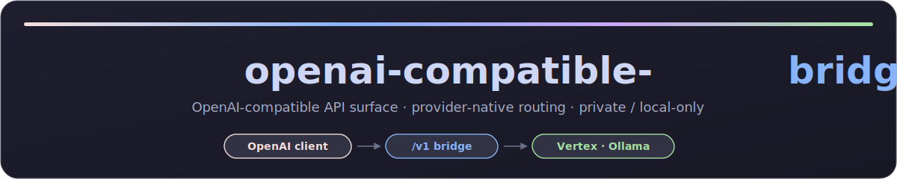
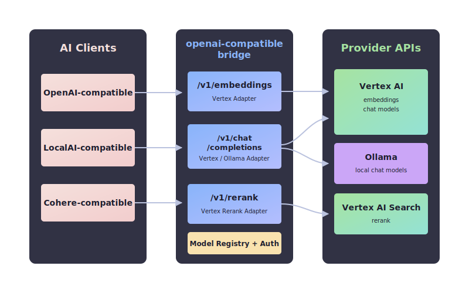
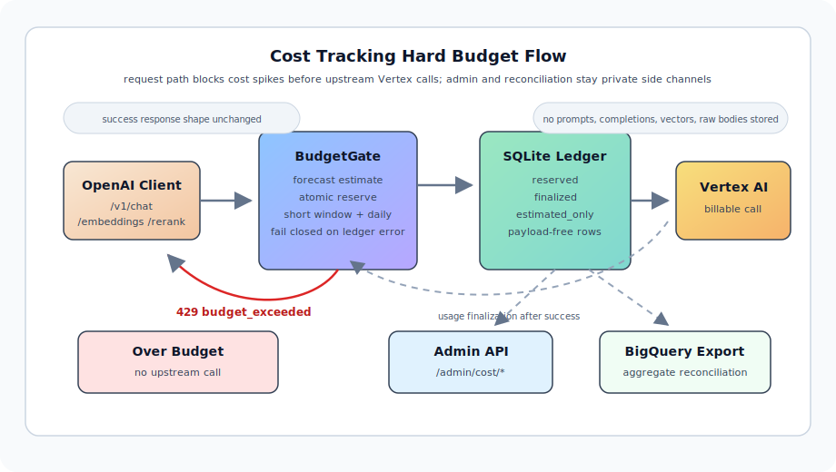

<a id="top"></a>

<div align="center">
  
</div>

<p align="center">
  
  
  
  
</p>

<div align="center">
  <h3>OpenAI-compatible API shape을 유지하면서 Vertex AI와 Ollama 같은 provider-native model API를 연결하는 <b>로컬/사내망 전용 private bridge</b>입니다.</h3>
</div>

> [!WARNING]
> **배포 위치 주의**: 이 bridge는 Vertex service account, local model endpoint, cost ledger 같은 운영 자원을 연결합니다. 보안과 과금 보호를 위해 **public internet에 노출하지 말고**, local machine 또는 private Docker network 안에서만 운용하십시오.

<p align="center">
  <a href="#arch"><b>🏛️ 시스템 아키텍처</b></a> &nbsp;·&nbsp;
  <a href="#quickstart"><b>🚀 빠른 시작</b></a> &nbsp;·&nbsp;
  <a href="#config"><b>⚙️ 환경 변수</b></a> &nbsp;·&nbsp;
  <a href="#api"><b>📡 API 참조</b></a>
</p>

---

## 💡 개발 배경 (Why?)

OpenAI-compatible client가 여러 provider를 직접 다루게 만들면 인증, payload, streaming, batching, 비용 추적 책임이 client마다 흩어집니다. 이 bridge는 client에는 `/v1/...` endpoint와 `model` alias만 노출하고, 내부에서 provider-native API 호출을 분기합니다.

* **Provider routing 단일화**: client 요청에는 provider field를 넣지 않습니다. `model` alias가 registry를 통해 Vertex 또는 Ollama provider adapter로 해석됩니다.
* **Vertex 운영 복잡도 흡수**: Vertex service account 인증, model별 batching, embeddings/rerank/chat payload 변환을 bridge가 담당합니다.
* **Local model 연결**: Ollama chat completions를 같은 `/v1/chat/completions` 표면으로 연결해 local model과 Vertex model을 같은 client 설정에서 다룰 수 있습니다.
* **비용 방어선 유지**: cost tracking을 켜면 billable request가 upstream 호출 전에 budget gate를 통과해야 합니다.

---

<a id="arch"></a>

## 🏛️ 시스템 아키텍처

<div align="center">
  
</div>

### 🎨 핵심 설계 포인트

<table width="100%">
  <tr>
    <td width="50%" valign="top">

#### 🟦 Drop-in API Shape
<p>OpenAI-compatible client는 기존처럼 <code>/v1/embeddings</code>, <code>/v1/chat/completions</code>, <code>/v1/rerank</code>를 호출합니다.</p>
    </td>
    <td width="50%" valign="top">

#### 🟩 Provider Adapter
<p>Bridge 내부에서 model alias를 Vertex 또는 Ollama provider-native model id로 해석합니다.</p>
    </td>
  </tr>
  <tr>
    <td width="50%" valign="top">

#### 🟪 Vertex Native Support
<p>Vertex embeddings, chat completions, Search Ranking rerank를 OpenAI-compatible response shape으로 변환합니다.</p>
    </td>
    <td width="50%" valign="top">

#### 🟧 Private Cost Gate
<p>Cost tracking이 켜진 경우 가격 설정 없는 billable model은 fail-closed 처리하고 hard budget 초과 요청은 upstream 호출 전에 차단합니다.</p>
    </td>
  </tr>
</table>

---

## 🧭 지원 범위

| Endpoint | Provider | 상태 |
|---|---|---|
| `POST /v1/embeddings` | Vertex | 지원 |
| `POST /v1/chat/completions` | Vertex | 지원 |
| `POST /v1/chat/completions` | Ollama | 지원 |
| `POST /v1/rerank` | Vertex | 지원 |

Ollama embeddings와 Ollama rerank는 현재 범위가 아닙니다. Retry와 rate-limit 신규 정책도 이 단계에는 포함하지 않습니다.

Ollama chat adapter는 OpenAI-compatible `response_format.type=json_object`를 Ollama JSON mode(`format: "json"`)로 전달하고, `response_format.type=json_schema`는 wrapper의 `name`/`strict`를 제외한 `json_schema.schema` object만 Ollama native structured output `format`으로 전달합니다. `json_schema` 응답은 bridge가 post-validation하며, Ollama/backend가 schema와 다른 JSON을 반환하면 raw content 없이 non-stream은 HTTP 502, stream은 SSE error의 `invalid_schema_output`으로 실패시킵니다. `STRUCTURED_OUTPUT_REPAIR_ENABLED=true`이면 dynamic Ollama Cloud `json_schema` 실패에 한해 지정된 Ollama Cloud 모델을 순서대로 최대 3회 추가 호출하고, 최종 validation을 통과한 JSON만 200으로 반환합니다. Ollama `think`는 기본 활성화 상태로 호출하며, 요청별 `reasoning_effort` 또는 `reasoning.effort`가 있으면 해당 요청에만 `high`, `medium`, `low`, `none`으로 override합니다. 응답의 `<think>...</think>` reasoning block은 OpenAI-compatible `message.content`와 streaming `delta.content`에서 제거합니다. Reasoning 제거 후 visible content가 비면 model-side upstream error로 처리합니다.

### 호출별 Ollama 모델 지정

Ollama chat model은 registry/env 추가 없이 요청마다 native model을 직접 지정할 수 있습니다. `model` 값을 `ollama:<native-model>` 형태로 보내면 bridge가 Ollama provider로 라우팅하고, prefix를 제거한 값을 Ollama native model id로 전달합니다.

```json
{
  "model": "ollama:deepseek-v4-flash:cloud",
  "messages": [
    {"role": "user", "content": "Reply with OK only."}
  ],
  "reasoning_effort": "medium",
  "max_tokens": 64,
  "temperature": 0
}
```

`ollama:`처럼 native model이 비어 있으면 HTTP 400 `invalid_model`로 거절합니다. `/v1/models`는 dynamic Ollama namespace를 열거하지 않고 registry에 등록된 모델만 반환합니다.
`reasoning_effort` 또는 `reasoning.effort`는 요청별 Ollama `think` override입니다. 허용값은 `high`, `medium`, `low`, `none`이며, `none`은 명시 요청일 때만 `think=false`로 전달됩니다. 필드가 없으면 `OLLAMA_THINK` env default를 그대로 사용하므로 runtime 재기동 없이 canary별 reasoning level을 바꿀 수 있습니다.

비용 추적이 켜져 있으면 dynamic model도 user-facing model id 기준으로 가격 설정이 필요합니다. Exact key가 우선이며, `COST_PRICING_JSON`에 `ollama:*` chat 가격을 명시하면 `ollama:<native-model>` 전체에 fallback으로 적용됩니다.

### Ollama structured output repair

Ollama Cloud는 strict structured output을 보장하지 않으므로 repair는 기본 OFF입니다. `STRUCTURED_OUTPUT_REPAIR_ENABLED=true`를 설정하면 dynamic `ollama:<native>` Cloud 모델의 `response_format.type=json_schema` 실패에 한해 repair chain을 실행합니다. 기본 repair chain은 다음 순서입니다.

1. `ollama:qwen3.5:cloud`
2. `ollama:gemma4:31b-cloud`
3. `ollama:glm-5.2:cloud`

`STRUCTURED_OUTPUT_REPAIR_MODELS`로 쉼표 구분 목록을 지정할 수 있지만 최대 3개만 사용합니다. Repair prompt에는 실패한 raw output을 넣지 않고, original messages, JSON schema, redacted failure category만 사용합니다. `stream=true`와 `json_schema` repair가 함께 켜지면 bridge는 token-by-token streaming 대신 buffered validation을 수행하고 valid final JSON만 SSE content chunk로 내보냅니다. 모든 attempt가 실패하면 raw content 없이 `invalid_schema_output`으로 실패합니다.

### Model Alias

Client 요청에는 provider field를 넣지 않습니다. `model` 값이 registry alias이며, bridge가 provider를 고릅니다.

```json
{
  "llama-local": {
    "provider": "ollama",
    "kind": "chat",
    "provider_model": "llama3.1"
  },
  "gemini-2.5-flash": {
    "provider": "vertex",
    "api": "generateContent",
    "kind": "chat",
    "location": "us-central1"
  }
}
```

---

<a id="config"></a>

## ⚙️ 환경 변수 설정

`.env` 파일을 생성하거나 컨테이너 환경 변수로 다음 값을 주입합니다. 전체 키 목록과 주석은 [`.env.example`](./.env.example)을 참고하세요.

| Variable | Default | Description |
|---|---|---|
| `BRIDGE_API_KEY` | `""` | Client request 보호용 선택적 Bearer token. |
| `MODEL_REGISTRY_JSON` | `""` | Model alias registry override JSON. |
| `EXTRA_MODELS` | `""` | Backward-compatible comma-separated Vertex predict model additions. |
| `OLLAMA_BASE_URL` | `http://127.0.0.1:11434` | Ollama native API base URL. Docker에서는 `http://host.docker.internal:11434` 권장. |
| `OLLAMA_HTTP_TIMEOUT_SECONDS` | `HTTP_TIMEOUT_SECONDS` | Ollama native API 전용 HTTP timeout. reasoning-heavy model은 더 길게 잡을 수 있음. |
| `OLLAMA_THINK` | `true` | Ollama `think` request field 기본값. `true`, `false`, `low`, `medium`, `high`, `omit` 지원. 요청별 `reasoning_effort`/`reasoning.effort`가 있으면 해당 요청에서 override. |
| `GOOGLE_APPLICATION_CREDENTIALS` | `""` | Vertex service account JSON path. |
| `VERTEX_PROJECT` | *(Required)* | GCP project id for Vertex. |
| `VERTEX_LOCATION` | `us-central1` | Default Vertex region. |
| `VERTEX_TASK_TYPE_DEFAULT` | `RETRIEVAL_DOCUMENT` | Default Vertex embedding task type. |
| `VERTEX_AUTO_TRUNCATE` | `true` | Vertex embedding auto truncate flag. |
| `TOKEN_REFRESH_SKEW_SECONDS` | `300` | Vertex access token을 만료 몇 초 전에 선갱신할지. |
| `MAX_CONCURRENCY` | `8` | Provider HTTP concurrency limit. |
| `HTTP_TIMEOUT_SECONDS` | `60` | Provider HTTP timeout. |
| `DEFAULT_MAX_INSTANCES` | `1` | 알 수 없는 Vertex predict model 호출 시 요청당 instance chunk 폴백. |
| `COST_TRACKING_ENABLED` | `false` | 비용 추적과 hard budget gate 활성화 여부. |
| `COST_LEDGER_PATH` | `""` | 컨테이너 내부 비용 원장 SQLite 파일 경로. Docker에서는 `/data/cost-ledger.db`. |
| `COST_LEDGER_DIR` | `./data` | (docker-compose 전용) 컨테이너 `/data`에 mount되는 host bind 경로. 원장 파일을 호스트에 보존. |
| `COST_CHAT_DEFAULT_MAX_OUTPUT_TOKENS` | `4096` | `max_tokens` 미지정 chat 요청의 비용 forecast용 응답 토큰 상한 추정값. |
| `COST_PRICING_JSON` | `""` | 모델/endpoint별 가격 JSON. `COST_PRICING_PATH`와 둘 중 하나를 사용. |
| `COST_PRICING_PATH` | `""` | 가격 JSON 파일 경로. |
| `COST_SHORT_WINDOW_SECONDS` | `""` | 단기 budget window 길이(초). 비용 추적 활성화 시 필수. |
| `COST_SHORT_WINDOW_LIMIT_USD` | `""` | 단기 window hard limit. 비용 추적 활성화 시 필수. |
| `COST_DAILY_LIMIT_USD` | `""` | 일 단위 hard limit. 비용 추적 활성화 시 필수. |
| `COST_ADMIN_ENABLED` | `false` | Private cost admin API 활성화 여부. |
| `COST_ADMIN_API_KEY` | `""` | Cost admin 전용 Bearer token. `BRIDGE_API_KEY`와 별도 값이어야 함. |
| `COST_RECONCILIATION_ENABLED` | `false` | Cloud Billing BigQuery reconciliation 활성화 여부. |
| `COST_RETENTION_REQUEST_DAYS` | `90` | Request-level 비용 원장 보존 기간. |
| `COST_RETENTION_AGGREGATE_MONTHS` | `13` | Aggregate/reconciliation 보존 기간. |

<details>
<summary><b>💡 복잡한 모델 라우팅 추가 방법</b></summary>
<br/>

`MODEL_REGISTRY_JSON`으로 alias별 provider, API type, region, provider-native model id를 직접 제어합니다. 같은 `/v1/chat/completions` 표면에 Vertex와 Ollama를 alias만으로 섞을 수 있습니다.

```json
{
  "text-embedding-005": {
    "provider": "vertex",
    "api": "predict",
    "kind": "embeddings",
    "location": "us-central1"
  },
  "llama-local": {
    "provider": "ollama",
    "kind": "chat",
    "provider_model": "llama3.1"
  }
}
```

</details>

### 비용 추적과 hard budget gate

<div align="center">
  
</div>

`COST_TRACKING_ENABLED=true`이면 모든 billable request는 provider 호출 전에 SQLite 원장에 forecast 비용을 예약합니다. 단기 window 또는 일 단위 limit을 넘는 요청은 upstream 호출 없이 HTTP 429 `budget_exceeded`로 차단됩니다. 성공 응답의 OpenAI-compatible shape에는 비용 필드를 추가하지 않습니다.

가격 설정은 코드에 내장하지 않고 `COST_PRICING_JSON` 또는 `COST_PRICING_PATH`로 주입합니다.

```json
{
  "source": "manual",
  "version": "YYYY-MM-DD",
  "currency": "USD",
  "models": {
    "gemma-4-26b-a4b-it-maas": {
      "chat": {
        "input_per_million": "",
        "output_per_million": ""
      }
    },
    "text-embedding-005": {
      "embeddings": {
        "embedding_per_million": ""
      }
    },
    "text-multilingual-embedding-002": {
      "embeddings": {
        "embedding_per_million": ""
      }
    },
    "gemini-embedding-001": {
      "embeddings": {
        "embedding_per_million": "0.15"
      }
    },
    "gemini-embedding-2": {
      "embeddings": {
        "embedding_per_million": "0.20"
      }
    },
    "semantic-ranker-512@latest": {
      "rerank": {
        "rerank_per_unit": ""
      }
    },
    "ollama:*": {
      "chat": {
        "input_per_million": "",
        "output_per_million": ""
      }
    }
  }
}
```

Docker Compose에서는 비용 원장 디렉터리를 `/data`에 mount합니다. `COST_LEDGER_DIR`(host 경로)가 유지되면 컨테이너를 재생성해도 `/data/cost-ledger.db`가 그대로 남습니다.

```bash
mkdir -p ./data
docker compose up -d --build
```

운영 확인용 private endpoint는 `COST_ADMIN_ENABLED=true`와 `COST_ADMIN_API_KEY`가 모두 설정된 경우에만 열립니다.

| Method | Endpoint | 용도 |
|---|---|---|
| `GET` | `/admin/cost/status` | 현재 spend, limit, reset time, health, reconciliation 상태 |
| `GET` | `/admin/cost/events` | Allowlist 기반 최근 비용 이벤트 |
| `GET` | `/admin/cost/reconciliation` | Cloud Billing export 대조 상태 |

Cloud Billing BigQuery reconciliation은 request path를 막지 않습니다. Export 미설정은 `unavailable`, 최근 billing row 지연은 `pending`, 권한/쿼리 오류는 `error`로 admin API에 노출됩니다. BigQuery export 연결 설정(`COST_BILLING_BIGQUERY_PROJECT` / `_DATASET` / `_TABLE`)은 [`.env.example`](./.env.example)과 [`docker-compose.yml`](./docker-compose.yml)에 선언되어 있습니다.

---

## 🎯 범용 AI 클라이언트 연동 가이드

Bridge를 로컬/사내망에 띄웠다면, OpenAI API 규격을 지원하는 도구에서 custom base URL만 이 bridge로 지정합니다.

| 설정 항목 | 입력할 값 | 비고 |
|---|---|---|
| **API Provider** | `OpenAI` 또는 compatible provider | 도구별 custom OpenAI-compatible provider 선택 |
| **Base URL** | `http://127.0.0.1:8000` | Docker host debug port를 쓰면 `http://127.0.0.1:8930` |
| **API Key** | `BRIDGE_API_KEY` 값 또는 dummy string | `BRIDGE_API_KEY`가 비어 있으면 인증은 강제되지 않음 |
| **Model Name** | Registry alias | 예: `gemini-2.5-flash`, `llama-local` |

Docker network 내부 client는 service DNS를 사용할 수 있습니다.

```text
http://openai-compatible-bridge
```

---

<a id="quickstart"></a>

## 🚀 빠른 시작

### ⚡ 요구사항

- uv
- Docker 및 Docker Compose
- Vertex 사용 시 GCP service account JSON key file (`roles/aiplatform.user`)
- Ollama 사용 시 local Ollama server

### 🧪 로컬 환경 (uv 사용)

```bash
uv run uvicorn openai_compatible_bridge.main:app --reload --port 8000
```

### 🐳 Docker Compose 환경

```bash
docker compose up -d --build
```

로컬 client는 `http://127.0.0.1:8000`을, Docker network 내부에서는 `http://openai-compatible-bridge`를 사용합니다.

---

<a id="api"></a>

## 📡 API 참조

| Method | Endpoint | 호환 규격 | Provider |
|---|---|---|---|
| `GET` | `/healthz` | Health check | Bridge |
| `GET` | `/v1/models` | OpenAI-compatible | Registry |
| `GET` | `/v1/models/{model_id}` | OpenAI-compatible | Registry |
| `POST` | `/v1/embeddings` | OpenAI-compatible | Vertex |
| `POST` | `/v1/chat/completions` | OpenAI-compatible | Vertex / Ollama |
| `POST` | `/v1/rerank` | Cohere / LocalAI-compatible | Vertex |
| `GET` | `/admin/cost/status` | Private admin | Cost ledger |
| `GET` | `/admin/cost/events` | Private admin | Cost ledger |
| `GET` | `/admin/cost/reconciliation` | Private admin | Billing reconciliation |

---

<p align="center">
  <sub><b>openai-compatible-bridge</b> · private / local-only</sub><br/><br/>
  <a href="#arch">🏛️ 아키텍처</a> &nbsp;·&nbsp;
  <a href="#quickstart">🚀 빠른 시작</a> &nbsp;·&nbsp;
  <a href="#top">⬆️ 맨 위로</a>
</p>
