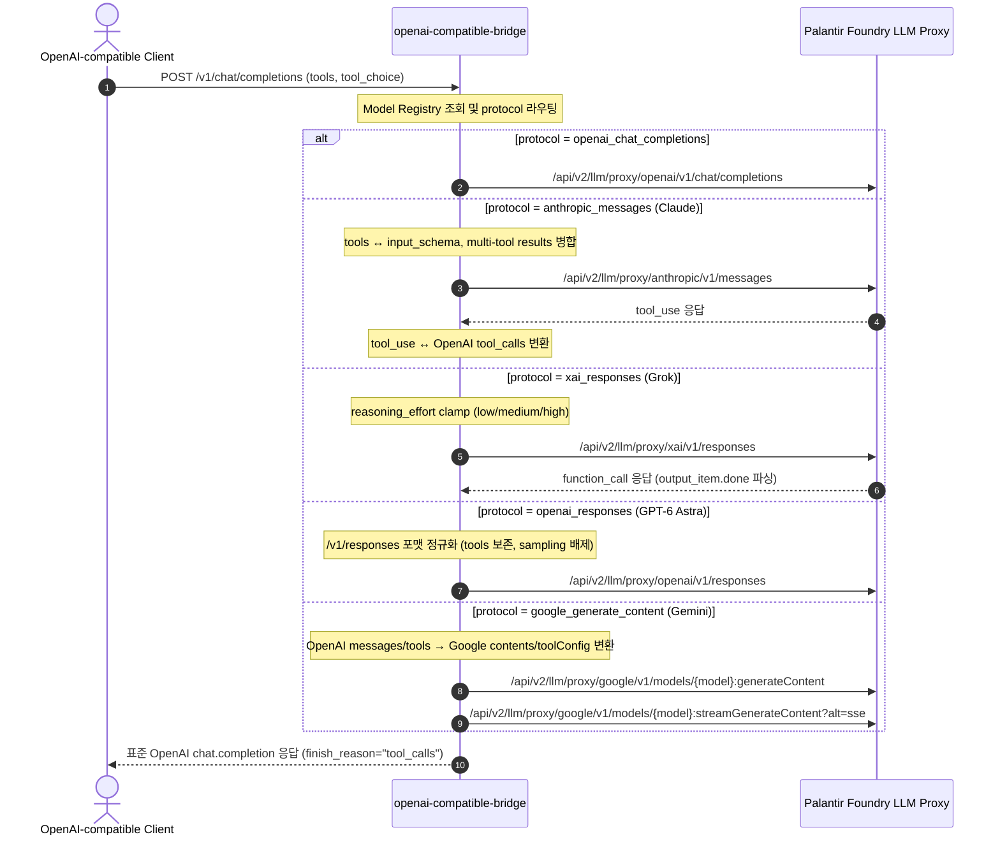

<a id="top"></a>

<div align="center">
  
</div>

<p align="center">
  
  
  
  
  
</p>

<div align="center">
  <h3>OpenAI-compatible API shape을 유지하면서 Vertex AI, Ollama, Palantir Foundry 같은 provider-native model API를 연결하는 <b>로컬/사내망 전용 private bridge</b>입니다.</h3>
</div>

> [!WARNING]
> **배포 위치 주의**: 이 bridge는 Vertex service account, local model endpoint, cost ledger 같은 운영 자원을 연결합니다. 보안과 과금 보호를 위해 **public internet에 노출하지 말고**, local machine 또는 private Docker network 안에서만 운용하십시오.

<p align="center">
  <a href="#arch"><b>🏛️ 시스템 아키텍처</b></a> &nbsp;·&nbsp;
  <a href="#quickstart"><b>🚀 빠른 시작</b></a> &nbsp;·&nbsp;
  <a href="#config"><b>⚙️ 환경 변수</b></a> &nbsp;·&nbsp;
  <a href="#api"><b>📡 API 참조</b></a>
</p>

---

## 💡 개발 배경 (Why?)

OpenAI-compatible client가 여러 provider를 직접 다루게 만들면 인증, payload, streaming, batching, 비용 추적 책임이 client마다 흩어집니다. 이 bridge는 client에는 `/v1/...` endpoint와 `model` alias만 노출하고, 내부에서 provider-native API 호출을 분기합니다.

* **Provider routing 단일화**: client 요청에는 provider field를 넣지 않습니다. `model` alias가 registry를 통해 Vertex, Ollama, Foundry provider adapter로 해석됩니다.
* **Vertex 운영 복잡도 흡수**: Vertex service account 인증, model별 batching, embeddings/rerank/chat payload 변환을 bridge가 담당합니다.
* **Local model 연결**: Ollama chat completions를 같은 `/v1/chat/completions` 표면으로 연결해 local model과 Vertex model을 같은 client 설정에서 다룰 수 있습니다.
* **Foundry 이기종 프로토콜 & 멀티턴 Tool Calling 완결**: Palantir Foundry의 5종 upstream 규격(OpenAI, Claude, Grok, Astra, Google Gemini)을 단일 규격으로 표준화하고 multi-turn structured tool call / tool result 사이클과 스트리밍을 투명하게 중계합니다.
* **비용 방어선 유지**: cost tracking을 켜면 `metered`로 분류된 모든 실제 provider HTTP 시도가 전송 직전에 forecast budget gate를 통과해야 합니다. 실제 청구액의 절대 상한을 보장하지는 않습니다.

---

<a id="arch"></a>

## 🏛️ 시스템 아키텍처

<div align="center">
  
</div>

### 🎨 핵심 설계 포인트

<table width="100%">
  <tr>
    <td width="50%" valign="top">

#### 🟦 Drop-in API Shape
<p>OpenAI-compatible client는 기존처럼 <code>/v1/embeddings</code>, <code>/v1/chat/completions</code>, <code>/v1/rerank</code>를 호출합니다.</p>
    </td>
    <td width="50%" valign="top">

#### 🟩 Provider Adapter
<p>Bridge 내부에서 model alias를 Vertex, Ollama 또는 Palantir Foundry provider-native model id로 해석합니다.</p>
    </td>
  </tr>
  <tr>
    <td width="50%" valign="top">

#### 🟪 Vertex Native Support
<p>Vertex embeddings, chat completions, Search Ranking rerank를 OpenAI-compatible response shape으로 변환합니다.</p>
    </td>
    <td width="50%" valign="top">

#### 🟧 Private Cost Gate
<p>Cost tracking이 켜진 경우 과금 분류가 불명확하거나 종량제 모델의 가격 설정이 불완전하면 fail-closed 처리합니다. PostgreSQL 공유 원장에서 forecast 예산 검사와 예약을 원자적으로 수행한 뒤에만 유료 호출을 전송합니다.</p>
    </td>
  </tr>
</table>

---

## 🧭 지원 범위

| Endpoint | Provider | 세부 프로토콜 / 기능 | 상태 |
|---|---|---|---|
| `POST /v1/embeddings` | Vertex | Google predict embeddings (`text-embedding-005` 등) | 지원 |
| `POST /v1/chat/completions` | Vertex | Gemini generateContent / Gemma MaaS | 지원 |
| `POST /v1/chat/completions` | Ollama | Local chat / dynamic `ollama:<model>` / JSON repair | 지원 |
| `POST /v1/chat/completions` | Foundry | `openai_chat_completions` (OpenAI proxy) | 지원 |
| `POST /v1/chat/completions` | Foundry | `anthropic_messages` (Claude proxy) | 지원 |
| `POST /v1/chat/completions` | Foundry | `xai_responses` (Grok proxy) | 지원 |
| `POST /v1/chat/completions` | Foundry | `openai_responses` (GPT-6 Astra proxy) | 지원 |
| `POST /v1/chat/completions` | Foundry | `google_generate_content` (Google Gemini native proxy) | 지원 |
| `POST /v1/rerank` | Vertex | Vertex AI Search Ranking rerank | 지원 |

Ollama embeddings와 Ollama rerank는 현재 범위가 아닙니다. Retry와 rate-limit 신규 정책도 이 단계에는 포함하지 않습니다.

### Foundry 이기종 프로토콜 및 Structured Tool Calling

Palantir Foundry의 이기종 upstream LLM Proxy를 단일 OpenAI 규격(`/v1/chat/completions`)으로 통합하며, 멀티턴 도구 호출(Tool Calling)과 스트리밍을 중계합니다.

* **Foundry protocol route**:
  - `openai_chat_completions`, `openai_responses`, `anthropic_messages`, `xai_responses`는 각 Foundry compatible proxy로 라우팅합니다.
  - `google_generate_content`는 OpenAI Chat Completions 요청을 Google native `generateContent`/`streamGenerateContent?alt=sse` 요청으로 변환합니다. Google native 경로에서 지원 여부가 확인되지 않은 reasoning override는 전달하지 않고 명시적으로 거부합니다.
  - 이 protocol은 Enrollment나 OpenAI proxy 노출을 자동으로 변경하지 않습니다. Foundry Enrollment가 활성화되어 있고 실제 Google native model 호출이 확인된 뒤, `MODEL_REGISTRY_JSON`에 명시적인 alias를 추가해야 합니다.



```mermaid
sequenceDiagram
    autonumber
    actor Client as OpenAI-compatible Client
    participant Bridge as openai-compatible-bridge
    participant Foundry as Palantir Foundry LLM Proxy

    Client->>Bridge: POST /v1/chat/completions (tools, tool_choice)
    Note over Bridge: Model Registry 조회 및 protocol 라우팅

    alt protocol = openai_chat_completions
        Bridge->>Foundry: /api/v2/llm/proxy/openai/v1/chat/completions
    else protocol = anthropic_messages (Claude)
        Note over Bridge: tools ↔ input_schema, multi-tool results 병합
        Bridge->>Foundry: /api/v2/llm/proxy/anthropic/v1/messages
        Foundry-->>Bridge: tool_use 응답
        Note over Bridge: tool_use ↔ OpenAI tool_calls 변환
    else protocol = xai_responses (Grok)
        Note over Bridge: reasoning_effort clamp (low/medium/high)
        Bridge->>Foundry: /api/v2/llm/proxy/xai/v1/responses
        Foundry-->>Bridge: function_call 응답 (output_item.done 파싱)
    else protocol = openai_responses (GPT-6 Astra)
        Note over Bridge: /v1/responses 포맷 정규화 (tools 보존, sampling 배제)
        Bridge->>Foundry: /api/v2/llm/proxy/openai/v1/responses
    else protocol = google_generate_content (Gemini)
        Note over Bridge: OpenAI messages/tools → Google contents/toolConfig 변환
        Bridge->>Foundry: /api/v2/llm/proxy/google/v1/models/{model}:generateContent
        Bridge->>Foundry: /api/v2/llm/proxy/google/v1/models/{model}:streamGenerateContent?alt=sse
    end

    Bridge-->>Client: 표준 OpenAI chat.completion 응답 (finish_reason="tool_calls")
```

1. **5종 이기종 프로토콜 자동 변환**:
   - `openai_chat_completions` (기본값): 표준 OpenAI 규격 프록시. `tools`, `tool_choice`, `parallel_tool_calls`를 있는 그대로 전달합니다.
   - `anthropic_messages`: Claude 모델군을 위한 변환 어댑터. OpenAI `tools`를 Anthropic `input_schema`로 변환하고, 모델의 `tool_use` 블록을 OpenAI 표준 `tool_calls` 배열로 변환합니다. 여러 도구 실행 결과(`tool_result`)가 연속 전달되면 Anthropic 규격에 맞춰 단일 `user` 턴 내 블록들로 안전하게 병합합니다.
   - `xai_responses`: Grok 모델군을 위한 Responses 프록시. OpenAI 도구 정의를 xAI `function_call` 구조로 변환하며, Foundry SSE 스트림의 `output_item.done` 이벤트에서 도구 호출 메타데이터를 정밀 파싱합니다. xAI 모델의 `reasoning_effort`는 `low`, `medium`, `high` 3단계로 엄격히 clamp됩니다.
   - `openai_responses`: GPT-6 Astra 계열 등 `/v1/responses`를 요구하는 모델 전용 프로토콜. `/v1/chat/completions`에서 도구 호출 시 거부되는 upstream 동작을 방지하며, sampling/reasoning 파라미터를 배제한 검증된 responses payload 규격으로 호출합니다.
   - `google_generate_content`: Gemini 모델군을 위한 Google native adapter. `messages`/`tools`/생성 파라미터를 `contents`/`systemInstruction`/`generationConfig`/`toolConfig`로 변환하고 `candidates`/`usageMetadata`/Google SSE를 OpenAI 응답으로 되돌립니다. Foundry Google proxy에서 검증되지 않은 reasoning override는 전달하지 않습니다.
2. **Streaming & Non-Streaming 완결성**:
   - 모든 프로토콜에서 SSE 토큰 스트리밍 중 실시간 `tool_calls` 델타(`index`, `id`, `name`, `arguments`)를 표준 규격으로 스트리밍하며 마지막에 `finish_reason: "tool_calls"`를 보장합니다.

### Ollama 특화 기능

Ollama chat adapter는 OpenAI-compatible `response_format.type=json_object`를 Ollama JSON mode(`format: "json"`)로 전달하고, `response_format.type=json_schema`는 wrapper의 `name`/`strict`를 제외한 `json_schema.schema` object만 Ollama native structured output `format`으로 전달합니다. `json_schema` 응답은 bridge가 post-validation하며, Ollama/backend가 schema와 다른 JSON을 반환하면 raw content 없이 non-stream은 HTTP 502, stream은 SSE error의 `invalid_schema_output`으로 실패시킵니다. `STRUCTURED_OUTPUT_REPAIR_ENABLED=true`이면 dynamic Ollama Cloud `json_schema` 실패에 한해 지정된 Ollama Cloud 모델을 순서대로 최대 3회 추가 호출하고, 최종 validation을 통과한 JSON만 200으로 반환합니다. Ollama `think`는 기본 활성화 상태로 호출하며, 요청별 `reasoning_effort` 또는 `reasoning.effort`가 있으면 해당 요청에만 `high`, `medium`, `low`, `none`으로 override합니다. 응답의 `<think>...</think>` reasoning block은 OpenAI-compatible `message.content`와 streaming `delta.content`에서 제거합니다. Reasoning 제거 후 visible content가 비면 model-side upstream error로 처리합니다.

### 호출별 Ollama 모델 지정

Ollama chat model은 registry/env 추가 없이 요청마다 native model을 직접 지정할 수 있습니다. `model` 값을 `ollama:<native-model>` 형태로 보내면 bridge가 Ollama provider로 라우팅하고, prefix를 제거한 값을 Ollama native model id로 전달합니다.

```json
{
  "model": "ollama:deepseek-v4-flash:cloud",
  "messages": [
    {"role": "user", "content": "Reply with OK only."}
  ],
  "reasoning_effort": "medium",
  "max_tokens": 64,
  "temperature": 0
}
```

`ollama:`처럼 native model이 비어 있으면 HTTP 400 `invalid_model`로 거절합니다. `/v1/models`는 dynamic Ollama namespace를 열거하지 않고 registry에 등록된 모델만 반환합니다.
`reasoning_effort` 또는 `reasoning.effort`는 요청별 Ollama `think` override입니다. 허용값은 `high`, `medium`, `low`, `none`이며, `none`은 명시 요청일 때만 `think=false`로 전달됩니다. 필드가 없으면 `OLLAMA_THINK` env default를 그대로 사용하므로 runtime 재기동 없이 canary별 reasoning level을 바꿀 수 있습니다.

비용 추적이 켜져 있고 `COST_PROVIDER_BILLING_JSON`에서 `ollama`를 `metered`로 분류했다면 dynamic model에도 user-facing model id 기준의 input/output 가격이 필수입니다. Exact key가 우선이며, `COST_PRICING_JSON`에 `ollama:*` chat 가격을 명시하면 `ollama:<native-model>` 전체에 fallback으로 적용됩니다. 유효한 `subscription`/`nonbillable` 분류는 비용 경로를 완전히 우회하며, Ollama라는 이름만으로 구독형이라고 가정하지 않습니다.

### Ollama structured output repair

Ollama Cloud는 strict structured output을 보장하지 않으므로 repair는 기본 OFF입니다. `STRUCTURED_OUTPUT_REPAIR_ENABLED=true`를 설정하면 dynamic `ollama:<native>` Cloud 모델의 `response_format.type=json_schema` 실패에 한해 repair chain을 실행합니다. 기본 repair chain은 다음 순서입니다.

1. `ollama:qwen3.5:cloud`
2. `ollama:gemma4:31b-cloud`
3. `ollama:glm-5.2:cloud`

`STRUCTURED_OUTPUT_REPAIR_MODELS`로 쉼표 구분 목록을 지정할 수 있지만 최대 3개만 사용합니다. Repair prompt에는 실패한 raw output을 넣지 않고, original messages, JSON schema, redacted failure category만 사용합니다. `stream=true`와 `json_schema` repair가 함께 켜지면 bridge는 token-by-token streaming 대신 buffered validation을 수행하고 valid final JSON만 SSE content chunk로 내보냅니다. 모든 attempt가 실패하면 raw content 없이 `invalid_schema_output`으로 실패합니다.

### Model Alias

Client 요청에는 provider field를 넣지 않습니다. `model` 값이 registry alias이며, bridge가 provider를 고릅니다.

```json
{
  "llama-local": {
    "provider": "ollama",
    "kind": "chat",
    "provider_model": "llama3.1"
  },
  "gemini-2.5-flash": {
    "provider": "vertex",
    "api": "generateContent",
    "kind": "chat",
    "location": "us-central1"
  },
  "foundry:gemini-3.8-flash": {
    "provider": "foundry",
    "kind": "chat",
    "provider_model": "gemini-3.8-flash",
    "protocol": "google_generate_content"
  }
}
```

---

<a id="config"></a>

## ⚙️ 환경 변수 설정

`.env` 파일을 생성하거나 컨테이너 환경 변수로 다음 값을 주입합니다. 전체 키 목록과 주석은 [`.env.example`](./.env.example)을 참고하세요.

| Variable | Default | Description |
|---|---|---|
| `BRIDGE_API_KEY` | `""` | Client request 보호용 선택적 Bearer token. |
| `MODEL_REGISTRY_JSON` | `""` | Model alias registry override JSON. |
| `EXTRA_MODELS` | `""` | Backward-compatible comma-separated Vertex predict model additions. |
| `OLLAMA_BASE_URL` | `http://127.0.0.1:11434` | Ollama native API base URL. Docker에서는 `http://host.docker.internal:11434` 권장. |
| `FOUNDRY_BASE_URL` | `""` | 고정된 Foundry OpenAI-compatible `/chat/completions` endpoint. `google_generate_content`는 이 URL의 host/root에서 Google native model endpoint를 안전하게 파생합니다. |
| `FOUNDRY_TOKEN` | `""` | Foundry bearer token. 운영에서는 Kubernetes Secret 또는 로컬 `.env`에만 저장. |
| `FOUNDRY_HTTP_TIMEOUT_SECONDS` | `HTTP_TIMEOUT_SECONDS` | Foundry 전용 HTTP timeout. |
| `OLLAMA_HTTP_TIMEOUT_SECONDS` | `HTTP_TIMEOUT_SECONDS` | Ollama native API 전용 HTTP timeout. reasoning-heavy model은 더 길게 잡을 수 있음. |
| `OLLAMA_THINK` | `true` | Ollama `think` request field 기본값. `true`, `false`, `low`, `medium`, `high`, `omit` 지원. 요청별 `reasoning_effort`/`reasoning.effort`가 있으면 해당 요청에서 override. |
| `STRUCTURED_OUTPUT_REPAIR_ENABLED` | `false` | Dynamic Ollama Cloud `json_schema` 실패에 한해 bounded repair chain 활성화. |
| `STRUCTURED_OUTPUT_REPAIR_MODELS` | `ollama:qwen3.5:cloud,ollama:gemma4:31b-cloud,ollama:glm-5.2:cloud` | Repair 후보 모델 순서. 최대 3개만 사용하며 `metered` 후보의 각 HTTP 시도도 cost/budget gate를 통과해야 함. |
| `GOOGLE_APPLICATION_CREDENTIALS` | `""` | Vertex service account JSON path. |
| `VERTEX_PROJECT` | *(Required)* | GCP project id for Vertex. |
| `VERTEX_LOCATION` | `us-central1` | Default Vertex region. |
| `VERTEX_TASK_TYPE_DEFAULT` | `RETRIEVAL_DOCUMENT` | Default Vertex embedding task type. |
| `VERTEX_AUTO_TRUNCATE` | `true` | Vertex embedding auto truncate flag. |
| `TOKEN_REFRESH_SKEW_SECONDS` | `300` | Vertex access token을 만료 몇 초 전에 선갱신할지. |
| `MAX_CONCURRENCY` | `8` | Provider HTTP concurrency limit. |
| `HTTP_TIMEOUT_SECONDS` | `60` | Provider HTTP timeout. |
| `DEFAULT_MAX_INSTANCES` | `1` | 알 수 없는 Vertex predict model 호출 시 요청당 instance chunk 폴백. |
| `COST_TRACKING_ENABLED` | `false` | 비용 추적과 forecast budget gate 활성화 여부. `false`는 명시적 보호 해제. |
| `COST_PROVIDER_BILLING_JSON` | `""` | `vertex`/`ollama`/`foundry`의 실제 계약을 `metered`/`subscription`/`nonbillable`로 명시. 추정 기본값 없이 빈 값·누락·잘못된 분류는 fail-closed. |
| `COST_TRACKING_PROVIDERS` | `""` | legacy 호환 키. 새 runtime은 무시하며 billing map만 사용. 과거의 빈 값=전체 추적 의미는 더 이상 적용하지 않음. |
| `COST_LEDGER_PATH` | `""` | 컨테이너 내부 비용 원장 SQLite 파일 경로. Docker에서는 `/data/cost-ledger.db`. |
| `COST_LEDGER_BACKEND` | `sqlite` | `sqlite`는 로컬 호환용, `postgres`는 공유 단일 authority. PostgreSQL 선택 시 SQLite 파일을 열거나 fallback하지 않음. |
| `COST_LEDGER_POSTGRES_DSN` | `""` | 전용 bridge DB의 외부 주입 연결 문자열. `COST_LEDGER_BACKEND=postgres` 필요. 자격증명은 저장소에 기록하지 않음. |
| `COST_LEDGER_DIR` | `./data` | (docker-compose 전용) 컨테이너 `/data`에 mount되는 host bind 경로. 원장 파일을 호스트에 보존. |
| `COST_CHAT_DEFAULT_MAX_OUTPUT_TOKENS` | `4096` | `max_tokens` 미지정 chat 요청의 비용 forecast용 응답 토큰 상한 추정값. |
| `COST_PRICING_JSON` | `""` | 종량제 모델/endpoint의 적용 가격 차원을 빠짐없이 명시하는 JSON. `COST_PRICING_PATH`와 둘 중 하나를 사용. |
| `COST_PRICING_PATH` | `""` | 가격 JSON 파일 경로. |
| `COST_SHORT_WINDOW_SECONDS` | `""` | 단기 budget window 길이(초). 종량제 비용 판정 시 필수. |
| `COST_SHORT_WINDOW_LIMIT_USD` | `""` | 단기 forecast limit. `unlimited`는 예산 한도 차단만 해제하며 분류/가격/DB 검사는 유지. |
| `COST_DAILY_LIMIT_USD` | `""` | UTC 일 단위 forecast limit. `unlimited`는 예산 한도 차단만 해제. |
| `COST_ADMIN_ENABLED` | `false` | Private cost admin API 활성화 여부. |
| `COST_ADMIN_API_KEY` | `""` | Cost admin 전용 Bearer token. `BRIDGE_API_KEY`와 별도 값이어야 함. |
| `COST_RECONCILIATION_ENABLED` | `false` | Cloud Billing BigQuery reconciliation 활성화 여부. |
| `COST_BILLING_BIGQUERY_PROJECT` | `""` | Cloud Billing export 조회용 BigQuery project id. |
| `COST_BILLING_BIGQUERY_DATASET` | `""` | Cloud Billing export dataset. |
| `COST_BILLING_BIGQUERY_TABLE` | `""` | Cloud Billing export table. |
| `COST_RETENTION_REQUEST_DAYS` | `90` | Request-level 비용 원장 보존 기간. |
| `COST_RETENTION_AGGREGATE_MONTHS` | `13` | Aggregate/reconciliation 보존 기간. |

<details>
<summary><b>💡 복잡한 모델 라우팅 추가 방법</b></summary>
<br/>

`MODEL_REGISTRY_JSON`으로 alias별 provider, API type, region, provider-native model id를 직접 제어합니다. 같은 `/v1/chat/completions` 표면에 Vertex, Ollama, Foundry를 alias만으로 섞을 수 있습니다. Foundry endpoint와 bearer token은 registry JSON이 아니라 `FOUNDRY_BASE_URL`/`FOUNDRY_TOKEN` runtime 설정으로 주입합니다.

Foundry chat alias는 선택적으로 `protocol`을 지정합니다. 허용값은 `openai_chat_completions`(기본값), `anthropic_messages`, `xai_responses`, `openai_responses`입니다. provider별 upstream endpoint는 배포된 Foundry host에서 고정 suffix로 파생되며, client 요청이 URL이나 bearer token을 바꿀 수 없습니다. 실제 운영 registry와 `FOUNDRY_TOKEN`은 저장소에 기록하지 않습니다.

```json
{
  "text-embedding-005": {
    "provider": "vertex",
    "api": "predict",
    "kind": "embeddings",
    "location": "us-central1"
  },
  "llama-local": {
    "provider": "ollama",
    "kind": "chat",
    "provider_model": "llama3.1"
  },
  "foundry:claude-3-7-sonnet": {
    "provider": "foundry",
    "kind": "chat",
    "protocol": "anthropic_messages",
    "provider_model": "claude-3-7-sonnet"
  },
  "foundry:grok-3": {
    "provider": "foundry",
    "kind": "chat",
    "protocol": "xai_responses",
    "provider_model": "grok-3"
  },
  "foundry:gpt-6-astra": {
    "provider": "foundry",
    "kind": "chat",
    "protocol": "openai_responses",
    "provider_model": "gpt-6-astra"
  }
}
```

</details>

### 비용 추적과 forecast budget gate

<div align="center">
  
</div>

`COST_TRACKING_ENABLED=true`이면 `COST_PROVIDER_BILLING_JSON`의 명시적 계약 분류로 비용 경로를 선택합니다. 현재 구현된 provider key는 `vertex`, `ollama`, `foundry`이며 OpenRouter는 구현되어 있지 않습니다.

| 분류 | 비용 경로 |
|---|---|
| `metered` | 적용 가격 차원을 모두 확인하고, 각 실제 HTTP 시도 직전에 DB 예산 검사와 forecast 예약을 완료해야 전송 |
| `subscription` / `nonbillable` | 유효한 분류가 확인되면 비용 경로 전체 우회. 가격·비용 설정 오류나 DB 장애와 무관하게 호출 가능 |
| 누락 / 알 수 없는 값 / 잘못된 분류 설정 | 과금 여부를 신뢰할 수 없어 fail-closed |

운영자가 **실제 payer 계약**을 확인하여 분류를 승인해야 합니다. 예를 들어 `{"vertex":"metered"}`는 Vertex 계약이 종량제일 때만 유효한 예이며 다른 provider의 호출은 분류 누락으로 차단합니다. Vertex는 일반적으로 종량제이지만 이름만으로 기본 분류를 채우지 않습니다. Foundry가 항상 종량제이거나 Ollama가 항상 구독형이라고 가정하지 않습니다. 이 map은 provider 전체 credential/baseURL 경로에 적용됩니다. 같은 provider 안에서 서로 다른 계약을 alias별로 섞을 수 없으며 **별도 deployment로 분리**해야 합니다.

`COST_TRACKING_PROVIDERS`의 빈 값=전체 추적 또는 특정 provider만 추적하던 동작은 legacy입니다. 새 runtime은 이 값을 무시하므로 종량제가 scope에서 빠지거나 구독형이 비용 원장에 기록되지 않습니다. `COST_TRACKING_ENABLED=false`는 기존처럼 **보호 기능 전체를 명시적으로 끈 상태**입니다. 두 limit을 `unlimited`로 설정하면 예산 한도 차단만 해제하며 종량제 분류·가격·DB 검사는 유지합니다.

#### 전송 직전의 공유 판정

PostgreSQL 사용 시 `bridge_cost.cost_events`가 유일한 admission authority입니다. 캐시 없이 같은 transaction의 advisory lock으로 `기간 내 확정 추정치 + 모든 미확정 예약 + 이번 forecast <= limit`을 검사하고 예약합니다. 단기 window와 UTC 일 단위 한도에 각각 적용하며 같은 금액은 허용합니다. 모든 pod가 같은 DB와 분류·가격·한도·lock 계약을 사용해야 합니다.

예약은 요청 입구에서 한 번만 하는 것이 아니라 **각 실제 provider HTTP 전송 직전**에 수행합니다. Embedding batch, repair, retry, streaming fallback도 각각 새 판정과 예약을 거칩니다. 분할 호출은 원 요청의 forecast 전체를 보수적으로 적용하고 repair는 변경된 모델과 forecast를 사용합니다. HTTP transport의 숨은 자동 재시도는 사용하지 않습니다.

이는 forecast admission의 직렬화이지 실제 청구액의 절대 상한이 아닙니다. 실제 비용이 forecast보다 크면 `sum(max(actual - forecast, 0))`만큼 초과할 수 있으며, 알 수 없는 청구·가격 오차·사용량 누락 때문에 **실제 invoice 초과액의 유한한 상한은 보장하지 않습니다**. 보수적 forecast와 한도를 운영자가 정해야 합니다.

가격은 `COST_PRICING_JSON` 또는 `COST_PRICING_PATH`로 주입합니다. 종량제 chat은 `input_per_million`과 `output_per_million`, embeddings는 `embedding_per_million`, rerank는 `rerank_per_unit`을 빠짐없이 명시해야 합니다. 아래는 구조 예시이며 빈 문자열은 유효한 가격이 아니므로 차단됩니다. 숫자도 현재 계약 가격의 증거가 아니며 운영자가 확인해야 합니다.

```json
{
  "source": "manual",
  "version": "YYYY-MM-DD",
  "currency": "USD",
  "models": {
    "gemma-4-26b-a4b-it-maas": {
      "chat": {
        "input_per_million": "",
        "output_per_million": ""
      }
    },
    "text-embedding-005": {
      "embeddings": {
        "embedding_per_million": ""
      }
    },
    "text-multilingual-embedding-002": {
      "embeddings": {
        "embedding_per_million": ""
      }
    },
    "gemini-embedding-001": {
      "embeddings": {
        "embedding_per_million": "0.15"
      }
    },
    "gemini-embedding-2": {
      "embeddings": {
        "embedding_per_million": "0.20"
      }
    },
    "semantic-ranker-512@latest": {
      "rerank": {
        "rerank_per_unit": ""
      }
    },
    "ollama:*": {
      "chat": {
        "input_per_million": "",
        "output_per_million": ""
      }
    }
  }
}
```

#### 응답을 기다리게 하지 않는 기록

사용량 기록은 DB I/O 없는 동기 enqueue로 전달합니다.
**프로세스 내 queue 256개 + 전용 record worker 1개**의 best-effort 방식이며 재시도는 0회입니다.
기록 때문에 upstream을 다시 호출하지 않습니다. 알려진 유효한 usage만 가격표 기반 actual 추정액으로 finalize합니다.
명시적 0은 허용하되 누락을 가짜 0으로 채우지 않습니다. 이 추정액은 확정 청구액이 아닙니다.
사용량 누락/오류, upstream 오류, 취소, queue 유실은 `reserved` forecast를 남깁니다.
PostgreSQL에서는 기간 경계·prune·재시작으로 해제되지 않습니다.

Admission은 별도의 **전용 worker 4개**를 사용하며 슬롯 외 대기열은 없습니다. 포화 시 fail-closed하고 caller timeout은 **2초**입니다. Timeout 이후에도 실행 중인 DB 작업은 완료될 때까지 슬롯을 점유합니다. DB connect/statement/lock timeout은 각각 **3/5/5초**입니다. Record 작업의 advisory lock이 다른 유료 admission을 늦추면 해당 호출도 timeout으로 차단될 수 있지만, 느린 기록과 별도 executor의 logging은 event loop나 응답 전달을 기다리게 하지 않습니다.

Shutdown 시 **1초** 동안 drain한 뒤 남은 queue job을 버립니다. 실행 중인 commit의 결과는 불확실할 수 있습니다. Queue는 durable outbox가 아니며 sticky 전역 latch도 없습니다. 이후 새 시도는 DB 상태를 다시 확인하므로 DB가 복구되면 자동으로 새 admission이 가능하지만, 이전 미확정 예약을 자동 해제하거나 replay하지는 않습니다.

Non-stream은 예산 초과 시 HTTP 429 `budget_exceeded`, admission 불가 시 HTTP 503 `cost_tracking_unavailable`로 유료 전송 전에 실패합니다. Streaming gate는 headers 전송 후 generator 안에서 실행되므로 HTTP status 변경 대신 SSE error `budget_exceeded` / `cost_tracking_unavailable` / `cost_config_error`와 `[DONE]`을 보냅니다. 거부된 시도는 유료 전송을 하지 않으며 성공 응답의 OpenAI-compatible shape에 비용 필드를 추가하지 않습니다.

#### SQLite 로컬 호환

`COST_LEDGER_BACKEND=sqlite`는 새 runtime에서도 선택 가능한 로컬 호환 기본값이며 **공유 multi-pod 예산 보장은 없습니다**. PostgreSQL 선택 시 SQLite 파일을 열거나 자동 fallback하지 않습니다. Docker Compose의 `/data` mount는 SQLite 호환용으로 유지하며, 기존 파일을 이관하거나 삭제하지 않습니다.

```bash
mkdir -p ./data
docker compose up -d --build
```

### PostgreSQL cost ledger 개발 후보

`COST_LEDGER_BACKEND=postgres`와 외부 주입 `COST_LEDGER_POSTGRES_DSN`을 명시합니다.
Neurons와 분리된 전용 논리 DB 및 고정 schema `bridge_cost`를 사용하고 runtime에는 DDL 권한을 주지 않습니다.
새 DB는 **빈 상태로 시작**하며 SQLite 데이터 복사·이관·역이관은 제공하지 않습니다.
Migrator 자격증명을 같은 DSN 환경 변수로 주입한 별도 승인 절차에서 schema만 적용합니다.
아래 명령은 절차 예시이며 이번 문서 작업에서 실행하지 않았습니다.

```bash
uv run python -m openai_compatible_bridge.core.cost_schema --apply
```

`/healthz`는 프로세스 생존, `/readyz`는 **admission DB 가용성**을 나타냅니다. Record 성공 여부가 readiness를 결정하지 않습니다. 전역 readiness를 rollout probe에 그대로 연결하면 유효한 구독형/비과금 요청까지 라우팅이 막힐 수 있으므로 Atlas의 별도 승인이 필요합니다. Compose의 liveness는 변경하지 않습니다.

상태의 `recording`에는 `queue_depth`, `queue_capacity`, `record_in_flight`, `records_written`, `records_dropped`, `record_failures`, `usage_missing`, `last_record_success_at`, `admission_in_flight`, `admission_capacity`, `admission_timeouts`, `admission_rejected`, `admission_failures`가 포함됩니다. 프로세스 로컬 지표는 abrupt kill 때 사라져 정확한 누락 건수를 알 수 없습니다. DB의 미정산 `reserved` 개수와 age를 함께 검토하고 임의 TTL로 해제하지 않습니다.

Rollback은 이미 소비한 PostgreSQL 예산을 우회하는 **과거 SQLite 자동 전환이 아닙니다**. 모든 pod의 유료 호출을 fence하고 PostgreSQL 기록/백업을 보존한 뒤 호환되는 PostgreSQL application revision으로만 되돌립니다. 그렇지 않으면 별도 승인된 reconciliation/carry-forward 전략이 마련될 때까지 유료 호출을 막습니다. 상세 경계는 [admission 계약](specs/cost-ledger-postgres/admission-contract.md), [Atlas 전환 초안](specs/cost-ledger-postgres/atlas-cutover.md), [검증 기록](specs/cost-ledger-postgres/verification.md)을 참고하세요. 이번 범위는 로컬 개발과 #17 갱신이며 서버 연결 확인·DB/Secret/PVC/배포/GitOps/이미지 게시/merge 작업은 하지 않습니다.

운영 확인용 private endpoint는 `COST_ADMIN_ENABLED=true`와 `COST_ADMIN_API_KEY`가 모두 설정된 경우에만 열립니다.

| Method | Endpoint | 용도 |
|---|---|---|
| `GET` | `/admin/cost/status` | 현재 spend, limit, reset time, health, reconciliation 상태 |
| `GET` | `/admin/cost/events` | Allowlist 기반 최근 비용 이벤트 |
| `GET` | `/admin/cost/reconciliation` | Cloud Billing export 대조 상태 |

Cloud Billing BigQuery reconciliation은 request path를 막지 않습니다. Export 미설정은 `unavailable`, 최근 billing row 지연은 `pending`, 권한/쿼리 오류는 `error`로 admin API에 노출됩니다. BigQuery export 연결 설정(`COST_BILLING_BIGQUERY_PROJECT` / `_DATASET` / `_TABLE`)은 [`.env.example`](./.env.example)과 [`docker-compose.yml`](./docker-compose.yml)에 선언되어 있습니다.

기존 [`SwiftBar Ollama 플러그인`](./scripts/swiftbar/ollama-cost.1m.py)은 admin API가 없으면 로컬 SQLite를 진단 fallback으로 읽는 legacy 동작이 있습니다. 이 값은 PostgreSQL의 현재 spend나 admission authority가 아닙니다. PostgreSQL 배포에서는 private admin 상태를 사용하며, 유효한 `subscription`/`nonbillable` 사용량은 새 원장에 기록하지 않습니다.

---

## 🎯 범용 AI 클라이언트 연동 가이드

Bridge를 로컬/사내망에 띄웠다면, OpenAI API 규격을 지원하는 도구에서 custom base URL만 이 bridge로 지정합니다.

| 설정 항목 | 입력할 값 | 비고 |
|---|---|---|
| **API Provider** | `OpenAI` 또는 compatible provider | 도구별 custom OpenAI-compatible provider 선택 |
| **Base URL** | `http://127.0.0.1:8000` | Docker host debug port를 쓰면 `http://127.0.0.1:8930` |
| **API Key** | `BRIDGE_API_KEY` 값 또는 dummy string | `BRIDGE_API_KEY`가 비어 있으면 인증은 강제되지 않음 |
| **Model Name** | Registry alias | 예: `gemini-2.5-flash`, `llama-local` |

Docker network 내부 client는 service DNS를 사용할 수 있습니다.

```text
http://openai-compatible-bridge
```

---

<a id="quickstart"></a>

## 🚀 빠른 시작

### ⚡ 요구사항

- uv
- Docker 및 Docker Compose
- Vertex 사용 시 GCP service account JSON key file (`roles/aiplatform.user`)
- Ollama 사용 시 local Ollama server

### 🧪 로컬 환경 (uv 사용)

```bash
uv run uvicorn openai_compatible_bridge.main:app --reload --port 8000
```

### 🐳 Docker Compose 환경

```bash
docker compose up -d --build
```

로컬 client는 `http://127.0.0.1:8000`을, Docker network 내부에서는 `http://openai-compatible-bridge`를 사용합니다.

---

<a id="api"></a>

## 📡 API 참조

| Method | Endpoint | 호환 규격 | Provider |
|---|---|---|---|
| `GET` | `/healthz` | 프로세스 생존 확인 | Bridge |
| `GET` | `/readyz` | Admission DB readiness. Record health와 별개이며 장애 시 503 | Bridge |
| `GET` | `/v1/models` | OpenAI-compatible | Registry |
| `GET` | `/v1/models/{model_id}` | OpenAI-compatible | Registry |
| `POST` | `/v1/embeddings` | OpenAI-compatible | Vertex |
| `POST` | `/v1/chat/completions` | OpenAI-compatible | Vertex / Ollama / Foundry |
| `POST` | `/v1/rerank` | Cohere / LocalAI-compatible | Vertex |
| `GET` | `/admin/cost/status` | Private admin | Cost ledger |
| `GET` | `/admin/cost/events` | Private admin | Cost ledger |
| `GET` | `/admin/cost/reconciliation` | Private admin | Billing reconciliation |

---

<p align="center">
  <sub><b>openai-compatible-bridge</b> · private / local-only</sub><br/><br/>
  <a href="#arch">🏛️ 아키텍처</a> &nbsp;·&nbsp;
  <a href="#quickstart">🚀 빠른 시작</a> &nbsp;·&nbsp;
  <a href="#top">⬆️ 맨 위로</a>
</p>
